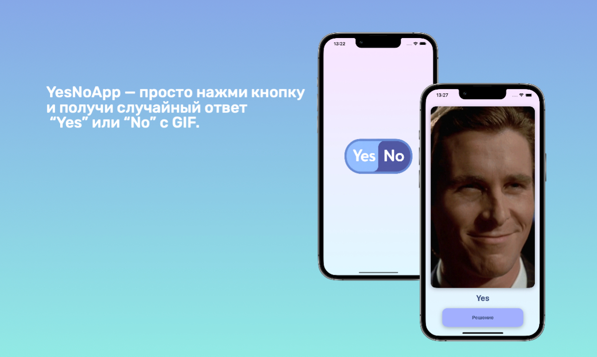

# YesNoApp

**YesNoApp** — это мой первый пет-проект на Swift, который демонстрирует работу с архитектурой MVP, сетевыми запросами и отображением GIF через WKWebView. Пользователь может нажимать кнопку, и приложение отобразит случайный GIF с ответом "Yes" или "No" на основе данных, полученных с API. Дизайн приложения был разработан мной с нуля, что позволило мне улучшить свои навыки в создании интерфейсов.



## Особенности:
- Использование **MVP** (Model-View-Presenter) архитектуры
- Обработка сетевых запросов с API
- Воспроизведение звуков при взаимодействии
- Обработка ошибок и отображение алертов
- Анимации и UI-эффекты
- Дизайн, разработанный самостоятельно

## Технологии:
- Swift
- UIKit
- MVP
- WKWebView
- JSONDecoder для обработки данных
- AVFoundation для работы с аудио

## Установка и запуск:
1. Клонируйте репозиторий:
   ```bash
   git clone https://github.com/soulhidee/YesNoApp.git
2. Откройте проект в Xcode.
3. Скомпилируйте и запустите приложение на устройстве или симуляторе.
